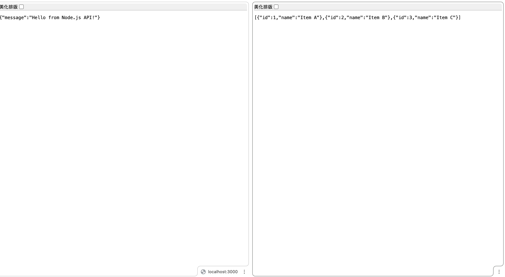
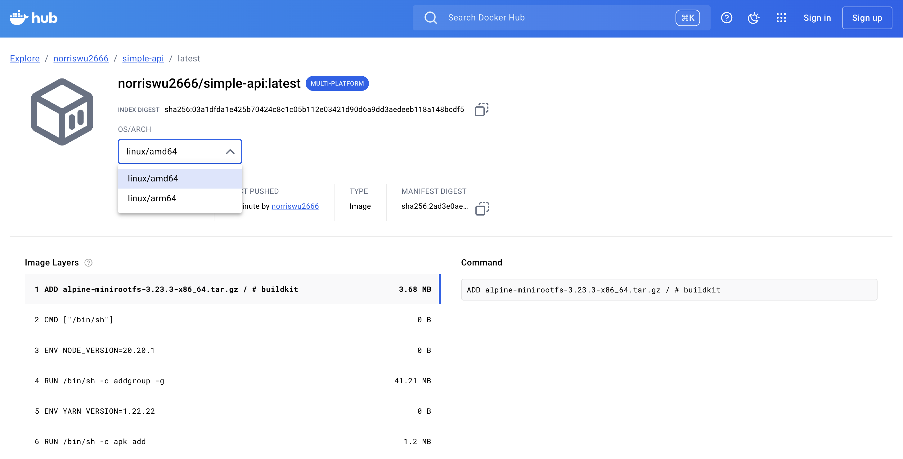
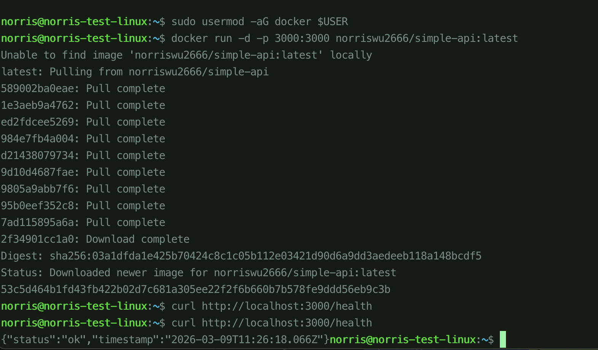

## 任務要求

以下為一份 TypeScript 的 Dockerfile，請說明有哪些方向可以優化此 Dockerfile。

```
FROM node:20
WORKDIR /app
COPY package*.json ./
RUN npm install
COPY tsconfig.json ./
COPY src ./src
RUN npm run build
EXPOSE 3000
CMD ["node", "dist/index.js"]
```

嘗試使用 buildx 將 dockerfile（不需要是這一份，可以請 AI 根據你的習慣語言生一個範例） 編譯成多架構的 image，Image 需要可以分別在 x86 跟 ARM 上執行。 完成後請嘗試驗證是否有成功執行（可以開雲端 VM 執行看看）。

## Dockerfile優化方向

### 構建階段

``` dockerfile
FROM node:20-alpine AS builder
WORKDIR /app
COPY package*.json ./
RUN npm ci
COPY tsconfig.json ./
COPY src ./src
RUN npm run build
```
###  運行階段（只保留必要檔案）

``` dockerfile
FROM node:20-alpine AS runner
WORKDIR /app
COPY package*.json ./
RUN npm ci --only=production
COPY --from=builder /app/dist ./dist
EXPOSE 3000
CMD ["node", "dist/index.js"]
```

---

### **2. 其他優化細節**

| 原本 | 優化 | 原因 |
|------|------|------|
| `node:20` | `node:20-alpine` | 映像檔小 3~4 倍 |
| `npm install` | `npm ci` | 更快更穩定，鎖定版本 |
| 沒有 `.dockerignore` | 加上 `.dockerignore` | 避免複製不必要的檔案 |

---

### **3. 加上 `.dockerignore`**
```
node_modules
dist
.git
*.log

```
---


### **優化效果比較**

| | 原本 | 優化後 |
|--|------|------|
| 映像大小 | ~1GB | ~200MB |
| 包含 devDependencies | ✅ | ❌（production only）|
| 包含原始碼 | ✅ | ❌ |

最關鍵的是**多階段構建**，可以讓最終映像不包含 TypeScript、devDependencies 等開發用工具，大幅縮小體積。

## 使用 buildx

嘗試使用 buildx 將 dockerfile（不需要是這一份，可以請 AI 根據你的習慣語言生一個範例） 編譯成多架構的 image，Image 需要可以分別在 x86 跟 ARM 上執行。
完成後請嘗試驗證是否有成功執行（可以開雲端 VM 執行看看）。

---

建立完成，檔案結構如下：


week1/task0/src/
├── index.js        # Express API
├── package.json
├── Dockerfile
└── .dockerignore
API 端點：

Method	Path	說明
GET	/	Hello message
GET	/health	健康檢查
GET	/items	取得列表
POST	/items	新增項目（body: { "name": "..." }）
建置與執行：


### 一般建置
docker build -t simple-api ./week1/task0/src

### 本地執行
docker run -p 3000:3000 simple-api

### 本地執行完畢



### 多架構建置（buildx）
docker buildx build \
  --platform linux/amd64,linux/arm64 \
  -t norriswu2666/simple-api:latest \
  --push \
  ./week1/task0/src

### 上傳image到dockerhub上



### RUN 在VM(x64)上

1. VM 上安裝好 Docker
2. 從 Docker Hub pull 你的 image 並執行：

`docker run -d -p 3000:3000 norriswu2666/simple-api:latest`

3. 驗證：curl http://localhost:3000/health

