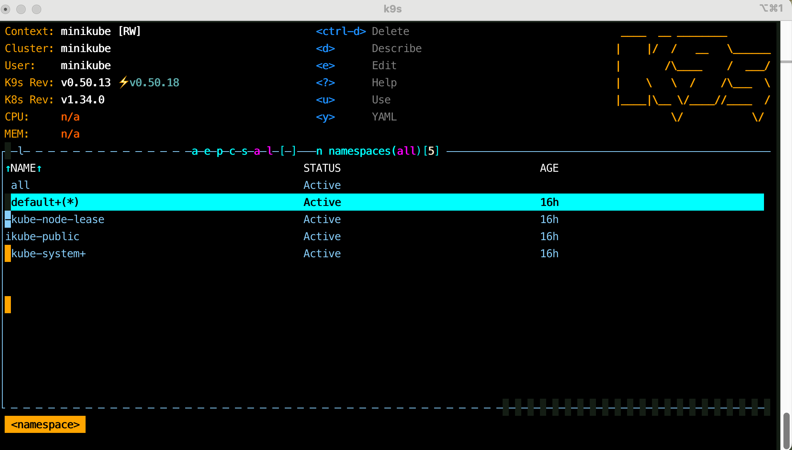
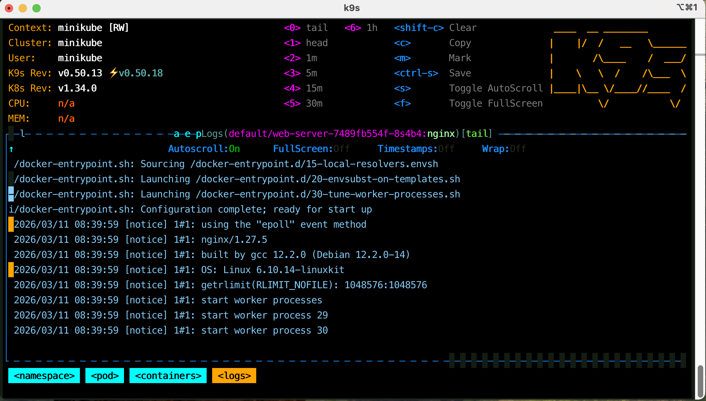
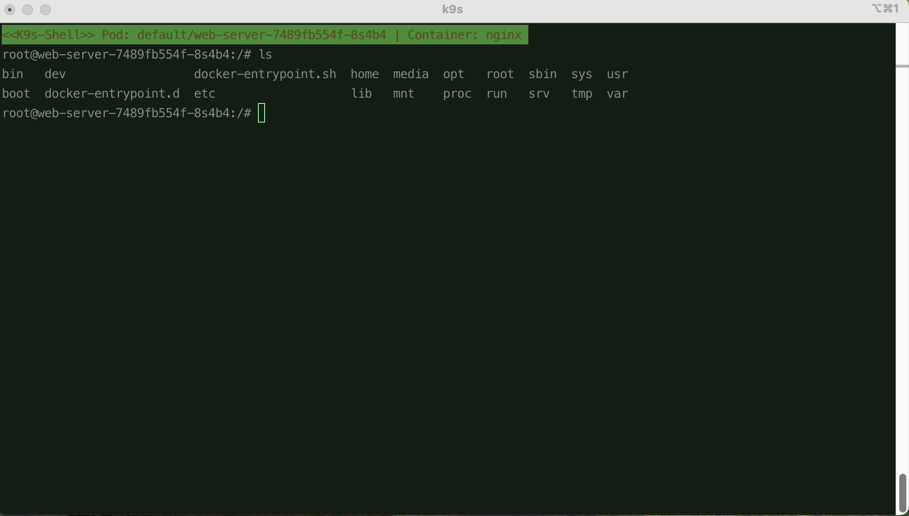
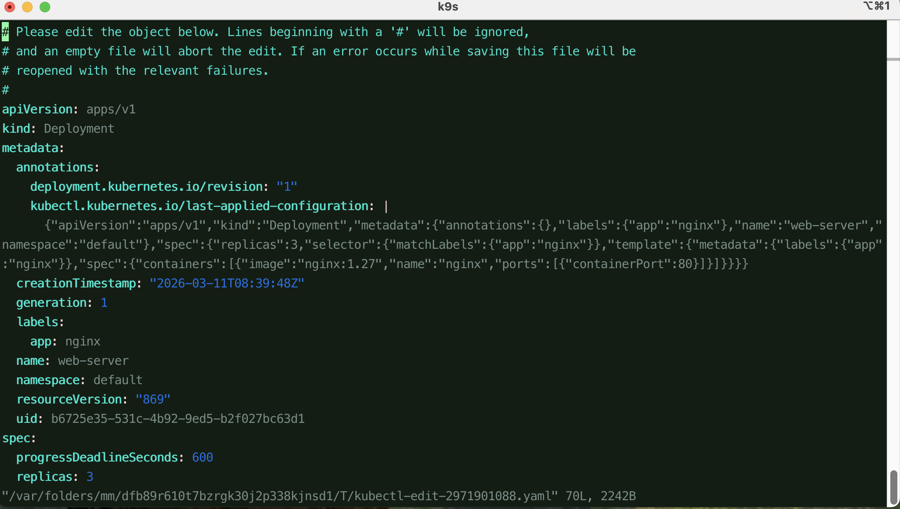
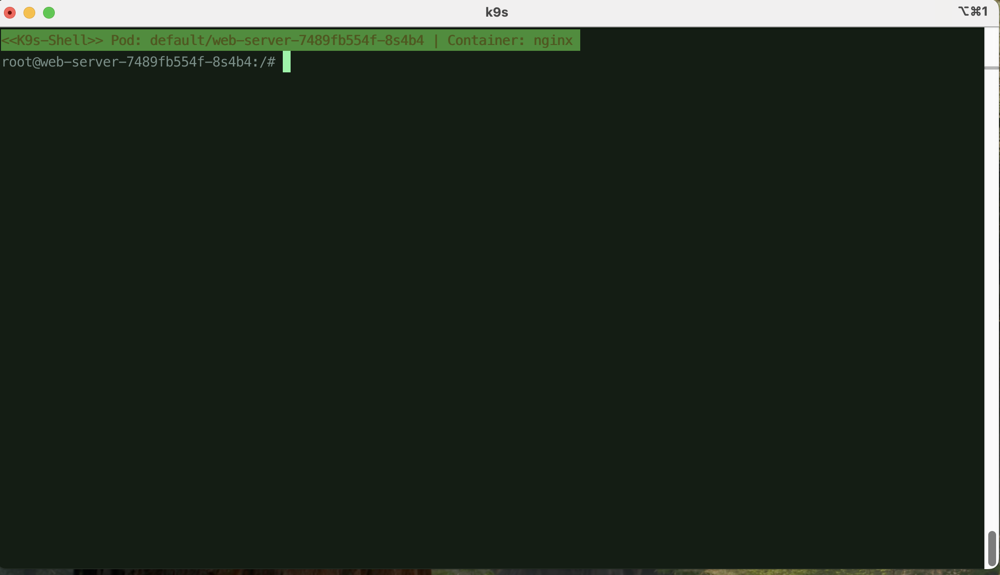

# 任務要求

此任務嘗試參加者熟悉 K9s，並根據指令文件學習指令：
https://k9scli.io/topics/commands/

安裝 k9s，並使用 k9s 指令開始使用。
輸入 :ns。

選擇一個 nginx pod，使用 l 觀察 logs。
   

使用 s exec 進 shell 查看檔案系統。

使用 e 更新 Nginx deployment 的 replicas。

使用 :xray deployment 查看 nginx 資源的關係圖。

按下 s 進入容器裡面輸入 ls / 看看檔案系統。
