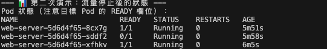

# 任務要求

閱讀服務探針文件，嘗試了解探針(Probe)的原理及功能
https://kubernetes.io/zh-cn/docs/tasks/configure-pod-container/configure-liveness-readiness-startup-probes/

```
---

## Kubernetes 三種探針，白話解釋

想像你的容器（container）是一個員工，Kubernetes 是老闆。老闆需要定期「探查」這個員工的狀態，這就是 Probe 的用途。

---

### 🔴 Liveness Probe（存活探針）— 「你還活著嗎？」

**用途：** 偵測容器有沒有「死掉」或卡住了。

**情境：** 程式雖然還在跑，但其實已經卡死（deadlock）、完全沒有反應了。

**動作：** 如果檢查失敗，Kubernetes 會**重啟**這個容器。

> 白話比喻：老闆打電話，員工不接 → 老闆判定這人廢了，直接叫他回家重新上班。

---

### 🟡 Readiness Probe（就緒探針）— 「你準備好接客了嗎？」

**用途：** 偵測容器是否「準備好」處理流量。

**情境：** 容器剛啟動、正在加載設定、或暫時過載中。

**動作：** 如果檢查失敗，Kubernetes 會把這個 Pod **從 Service 的流量路由中移除**（不重啟），等它準備好再送流量進來。

> 白話比喻：員工雖然有在上班，但還沒準備好接待客人。老闆就先不把客人轉給他，等他說「好了」再轉。

---

### 🟢 Startup Probe（啟動探針）— 「你開機完成了嗎？」

**用途：** 專門給**啟動很慢**的應用程式用（例如 Java 應用、大型資料庫）。

**情境：** 如果只用 Liveness Probe，老應用還沒啟動完就被判死、一直重啟，陷入無限迴圈。

**動作：** Startup Probe 通過之前，Liveness 和 Readiness Probe **都不會啟動**，給足夠的時間讓應用慢慢起床。

> 白話比喻：新員工第一天報到，老闆給他一段「適應期」，在這段時間不要求他馬上接電話，等他正式就位再開始考核。

---

### 三種探針比較

| | Liveness | Readiness | Startup |
|---|---|---|---|
| 問題 | 還活著嗎？ | 準備好了嗎？ | 啟動完了嗎？ |
| 失敗後果 | 重啟容器 | 停止送流量 | 繼續等（超時才重啟） |
| 使用時機 | 防卡死 | 防流量打進未就緒的服務 | 應用啟動很慢時 |

---

### 探針的三種檢查方式

- **HTTP GET**：打一個 HTTP 請求，回傳 200-399 就算成功
- **TCP Socket**：嘗試建立 TCP 連線，能連上就算成功  
- **exec command**：在容器裡執行一個指令，exit code 為 0 就算成功
```

發揮你的創意的時候到了，延續 Task1，對於這個 Nginx Deployment，因為特殊狀況需求，你現在希望可以停止其中一個 Pod 的流量（注意！你並不希望刪除該 Pod 以及關閉該 Pod 上的 Nginx 服務）。

-> 這要使用 Readiness Probe 的功能，讓 Kubernetes 認定這個 Pod 不「就緒」，就不會把流量路由到這個 Pod 上了，但該 Pod 仍然存在並且 Nginx 服務仍在運行。

嘗試用 Probe 解決該問題。

## 🎯 創意解決方案：使用 Readiness Probe 控制 Pod 流量

### 解決思路
使用 **Readiness Probe** + **流量開關文件** 的巧妙組合：

- **核心原理**：Readiness Probe 檢查容器內的 `/tmp/traffic-enabled` 文件
- **文件存在** → Pod 正常接收流量（包含在 Service endpoints 中）  
- **文件不存在** → Pod 被從流量路由中移除，但容器和 Nginx 服務繼續正常運行

### 快速演示
```bash
# 進入 task3/src 目錄
cd week1/task3/src

# 執行一鍵演示腳本
./demo-traffic-control.sh
```

### 手動操作步驟

1. **更新現有 Task1 Deployment（添加 Readiness Probe）**
```bash
# 套用更新後的 task1 配置
kubectl apply -f ../task1/src/deployment.yaml

# 等待滾動更新完成
kubectl rollout status deployment/web-server
```

2. **停止特定 Pod 流量**
```bash
# 選擇要停止流量的 Pod
kubectl get pods -l app=nginx
kubectl exec <pod-name> -- rm /tmp/traffic-enabled
```

3. **觀察效果**
```bash
# 查看 Pod 狀態 (READY 會變成 0/1)
kubectl get pods -l app=nginx

# 查看 Service endpoints (該 Pod IP 會被移除)
kubectl get endpoints web-server-svc
```


4. **恢復 Pod 流量**
```bash
kubectl exec <pod-name> -- sh -c 'echo "ready" > /tmp/traffic-enabled'
```

### 🔍 配置說明

新的 Deployment 配置重點：
- **Readiness Probe**：每 5 秒檢查一次 `/tmp/traffic-enabled` 文件
- **PostStart Hook**：容器啟動時自動創建流量開關文件  
- **Liveness Probe**：確保 Nginx 服務健康運行

詳細配置和使用說明請參考：[README-traffic-control.md](src/README-traffic-control.md)


