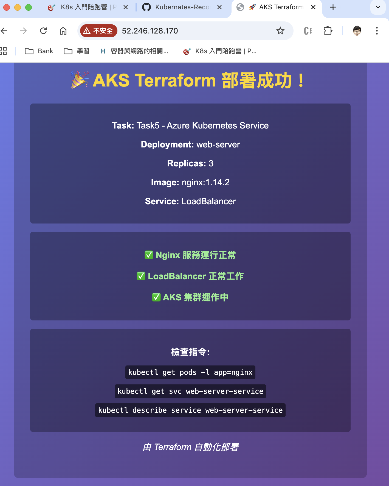

# 任務目標

嘗試創建任一雲端 K8s Cluster，使用任何輔助創建 Cluster 的方式，創建該 Cluster 並將創建步驟留存下來成可重復方便使用及 cleanup 的形式。

例如，可使用 Terraform 或 pluimi 這種 IaC 工具，創建 Linode 的 LKE Cluster，
或是使用 eksctl 這種雲廠商官方工具，透過 yaml 檔建立 Cluster 設定。
提供幾個選項供大家參考：

Terraform
Crossplane
Pulumi
提交並分享你的設定方式，並創建 Task1 的資源，但把 Service 改成 loadbalancer，查看雲端的 Load balancer 是否有成功創建。
若有，嘗試透過該 Load balancer 存取 Nginx 頁面。

# 拆解任務

1. 技術: Terraform with Azure AKS
2. Task1 資源
```
類型： Deployment
名稱： web-server
副本數 (Replicas)： 3
標籤 (Labels)： app: nginx
映像檔： nginx:1.14.2
容器埠號： 80
類型： Service(loadbalancer)
```

3. load balancer 存取 Nginx 頁面

---

# 任務說明

## 1. 使用 Terraform 建立 Azure AKS Cluster

透過 Terraform 撰寫 IaC 配置，自動化建立 Azure Kubernetes Service (AKS) 集群。

**Terraform 資源配置：**
- `azurerm_resource_group`：建立 Resource Group（名稱附加隨機後綴避免命名衝突）
- `azurerm_kubernetes_cluster`：建立 AKS 集群
  - 區域：East Asia
  - Kubernetes 版本：1.35
  - Node Pool：`Standard_DS2_v2`，預設 2 個節點，啟用 Auto Scaling（1～5 節點）
  - 身份驗證：SystemAssigned Managed Identity
  - 網路插件：kubenet，Load Balancer SKU：Standard
- `local_file`：將 kubeconfig 輸出至本地 `./kubeconfig` 檔案，方便後續 kubectl 操作

**執行流程：**
```bash
terraform init
terraform plan
terraform apply
export KUBECONFIG=./kubeconfig
```

---

## 2. 部署 Kubernetes 資源

**Deployment（`deployment.yaml`）：**
- 名稱：`web-server`，映像檔：`nginx:1.14.2`，副本數：3
- 使用 ConfigMap 掛載自訂 HTML 首頁
- 設定 Liveness / Readiness Probe 確保健康狀態
- 設定 Pod Anti-Affinity，讓 3 個副本分散在不同節點

**Service（`service.yaml`）：**
- 類型：`LoadBalancer`，對外暴露 Port 80 / 443
- 套用 Azure 特定 Annotation 設定健康探測

**額外資源：**
- `NetworkPolicy`：限制 nginx Pod 僅允許 Port 80 入流量及 DNS/HTTP/HTTPS 出流量
- `HorizontalPodAutoscaler`：CPU > 70% 或記憶體 > 80% 時自動擴展，最多 10 個副本

```bash
kubectl apply -f deployment.yaml
kubectl apply -f service.yaml
```

---

## 3. 透過 Load Balancer 存取 Nginx

Azure 自動為 LoadBalancer Service 建立 Azure Load Balancer 並分配公開 IP。

```bash
kubectl get svc web-server-service
```

取得外部 IP 後，透過瀏覽器存取，成功顯示自訂 Nginx 頁面：



Load Balancer 外部 IP：`52.246.128.170`

---

## 4. 清理資源

```bash
terraform destroy -auto-approve
```
